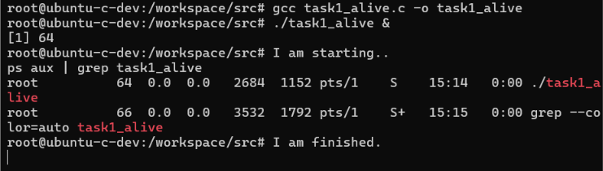
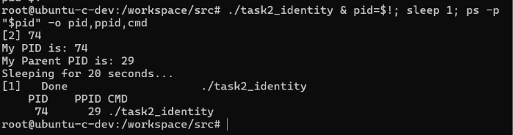
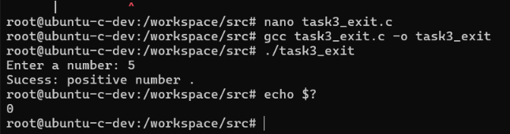
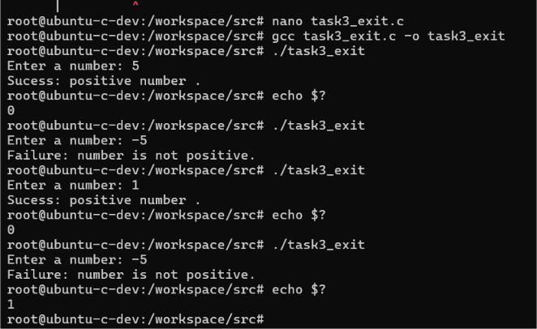
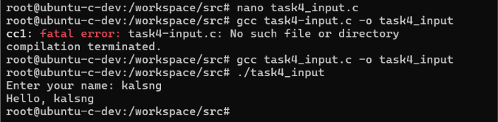
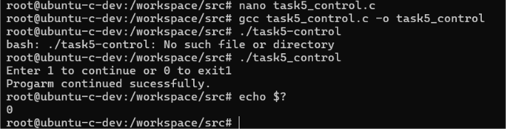
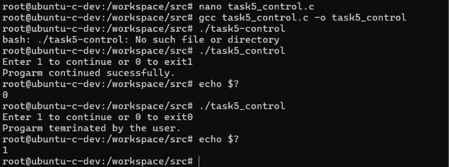
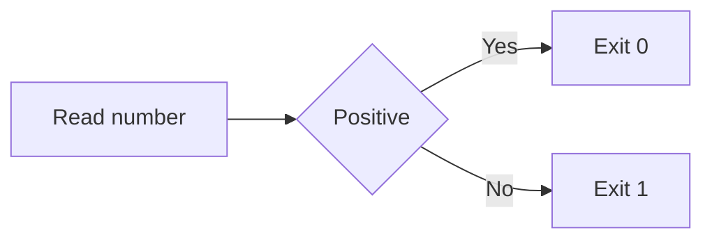
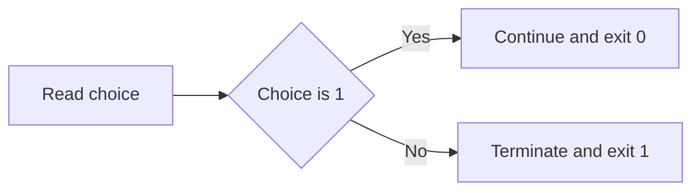

# Process Lifecycles and OS Interaction Lab

Five C programs demonstrating Linux processes, PID and PPID, exit codes, standard input and output, and conditional termination.

## Learning Objectives

- Compile and run C programs in Linux.
- View a running process with `ps`.
- Read a process ID and parent process ID.
- Understand success code `0` and failure code `1`.
- Use standard input and output in C.
- Control how a program ends from user input.

## Tasks

| Task | Source | Concept |
|---:|---|---|
| 1 | `src/task1_alive.c` | Background process |
| 2 | `src/task2_identity.c` | PID and PPID |
| 3 | `src/task3_exit.c` | Exit codes |
| 4 | `src/task4_input.c` | Standard input and output |
| 5 | `src/task5_control.c` | Conditional termination |

## Compile Commands

```bash
cd src
gcc task1_alive.c -o task1_alive
gcc task2_identity.c -o task2_identity
gcc task3_exit.c -o task3_exit
gcc task4_input.c -o task4_input
gcc task5_control.c -o task5_control
```

Run a compiled program with `./program_name`. For example:

```bash
./task1_alive
```

## Evidence

### Task 1



### Task 2



### Task 3





### Task 4



### Task 5





## Flow Diagrams

### Task 1


### Task 2


### Task 3



### Task 4


### Task 5



## Conclusion

I learned how C programs become Linux processes and how Linux reports process identity and exit status. The screenshots show that each program compiled and produced the expected result.
